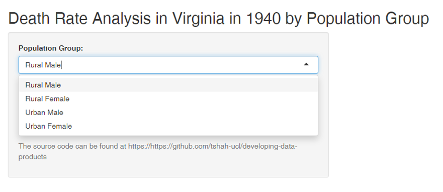
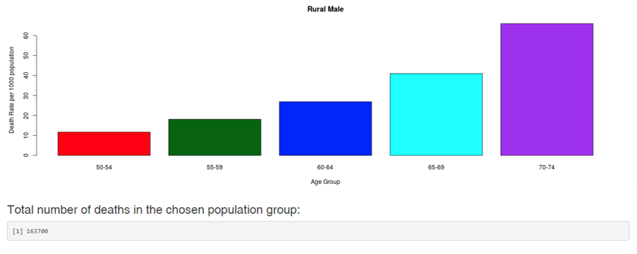

Shiny App presentation - Developing Data Products
========================================================
author: Tina S
date: 21/10/2020
autosize: true

Introduction
========================================================

This Shiny application shows the number of Deaths in Virginia in 1940.

The user can select a population group of either Rural Male, Rural Female, Urban Male or Urban Female from the dropbox.

The app then shows a bar chart of the number of deaths in that population group by age groups (50-54, 55-59, 60-64, 65-69, 70-74). It also shows the total number of deaths for that population group.

- The application is available at: https://rmhatsh.shinyapps.io/Developing_Data_Products_Assignment/
- The source code is available at: https://https://github.com/tshah-ucl/developing-data-products

Dataset
========================================================

This app uses the 'VADeaths' dataset, which contains the Death Rates per 1000 population of Virginia in 1940. They are cross-classified by age group (rows) and population group (columns).

```r
head(VADeaths)
```

```
      Rural Male Rural Female Urban Male Urban Female
50-54       11.7          8.7       15.4          8.4
55-59       18.1         11.7       24.3         13.6
60-64       26.9         20.3       37.0         19.3
65-69       41.0         30.9       54.6         35.1
70-74       66.0         54.3       71.1         50.0
```

How the app works
========================================================

- The user selects a Population Group from the dropbox.  
- The bar graph is automatically generated for that population group.   
- The bar chart is automatically refreshed each time a new population group is selected.  



Example output from the app
========================================================

When Rural Male is selected, the following graph is generated:



